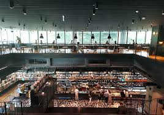
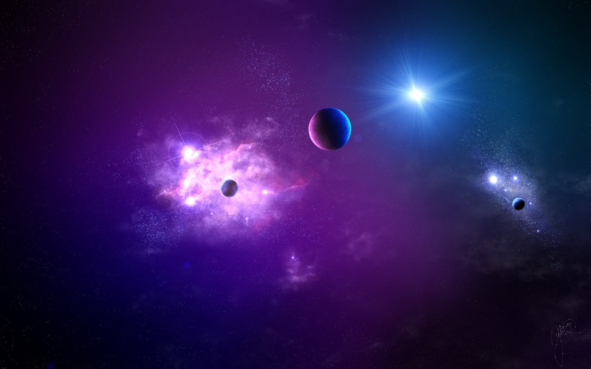

## 문제 : 1

Q: 다음 이미지에 대한 설명 중 옳지 않은 것은 무엇인가요?
- (1) 넓은 매장 내부에 여러 진열대와 판매대가 보입니다.
- (2) 매장은 2층 구조로 위층에 좌석이나 카페 공간이 있습니다.
- (3) 매장에 있는 모든 사람들은 흰색 유니폼을 입고 일하고 있습니다.
- (4) 천장에 여러 개의 조명이 달려 있어 실내가 밝습니다.

Listening: Which of the following descriptions of the image is incorrect?
- (1) The image shows a large store interior with many displays and counters.
- (2) The building has two floors, and there is seating or a cafe area on the upper level.
- (3) Everyone in the store is working in white uniforms.
- (4) There are many lights on the ceiling making the interior bright.

정답 : (3) 매장에 있는 모든 사람이 흰색 유니폼을 입고 있는 것은 아니고, 고객과 직원들이 다양한 옷을 입고 있습니다.

--------------------------------

## 문제 : 2

Q: 다음 이미지에 대한 설명 중 옳지 않은 것은 무엇인가요?
- (1) 중앙 왼쪽에 보라색과 분홍색이 섞인 성운이 보입니다.
- (2) 오른쪽 위에 매우 밝은 별이 빛나고 있습니다.
- (3) 이미지에는 여러 개의 행성들이 떠 있습니다.
- (4) 사진에는 야경의 도시 스카이라인이 포함되어 있습니다.

Listening: Which of the following descriptions of the image is incorrect?
- (1) A purple and pink nebula is visible near the center-left.
- (2) A very bright star is shining at the top right.
- (3) Several planets are floating in the scene.
- (4) The image includes a nighttime city skyline.

정답 : (4) 이 이미지는 우주 장면으로 도시 스카이라인은 포함되어 있지 않습니다.

--------------------------------

